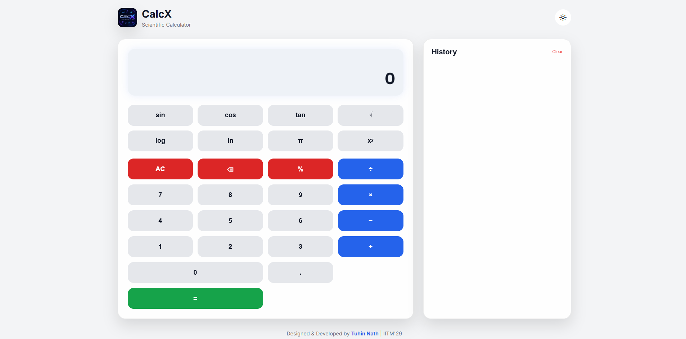
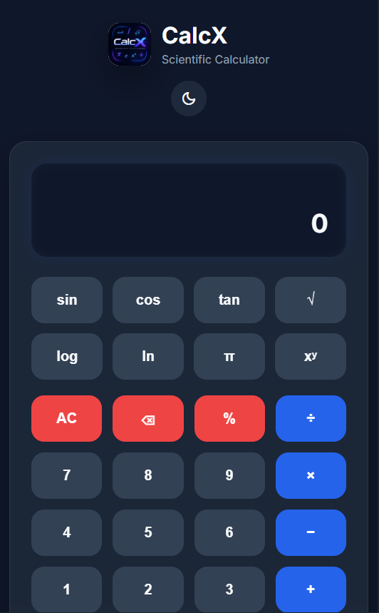

# CalcX – Modern Scientific Calculator

A modern , responsive and elegant scientific calculator built using **HTML, CSS & JavaScript**. CalcX combines a clean Apple-inspired interface with essential scientific operations making it both functional and visually appealing.

---

##  Project Preview

### Dark Mode (Desktop)


---

### Light Mode (Desktop)



---

### Mobile view



---

### Tablet view


---


## Features

### Calculator Functions

* Addition, Subtraction, Multiplication & Division
* Percentage calculations
* Decimal support
* Parentheses support
* Power (`xʸ`)
* Pi (`π`)

### Scientific Functions

* Square Root (`√`)
* Sine (`sin`)
* Cosine (`cos`)
* Tangent (`tan`)
* Logarithm (`log`)
* Natural Log (`ln`)

### User Interface

* Apple-inspired modern design
* Responsive layout
* Dark & Light mode
* Smooth animations
* Calculation history
* Keyboard support
* Custom application logo

---

## Built With

* HTML5
* CSS3
* JavaScript (Vanilla)
* Google Fonts (Inter)
* Material Symbols

---

## Project Structure

```text
CalcX/
│
├── index.html
├── README.md
│
├── css/
│   ├── variables.css
│   ├── style.css
│   └── animations.css
│
├── js/
│   └── script.js
│
├── assets/
│   └── logo.png
│   
│
└── screenshots/
```

---

## Getting Started

### Clone the repository

```bash
git clone https://github.com/tuhin-nath/CalcX-Scientific-Calculator 
```

### Open the project

Simply open `index.html` in your browser, or use **Live Server** in Visual Studio Code.

---

## Keyboard Shortcuts

| Key       | Action                |
| --------- | --------------------- |
| 0–9       | Enter numbers         |
| + - * /   | Operators             |
| Enter     | Calculate             |
| Backspace | Delete last character |
| Esc       | Clear display         |

---

## Responsive Design

CalcX is optimized for:

*  Desktop
*  Mobile
*  Tablet

---

## Live Demo

**GitHub Pages:**

```
https://github.com/tuhin-nath/CalcX-Scientific-Calculator 
```


---

## Future Improvements

* Memory functions (M+, M-, MR)
* More scientific operations
* Improved accessibility
* Performance optimizations

---

## Contributing

Contributions, ideas, and suggestions are always welcome.

1. Fork the repository
2. Create a feature branch
3. Commit your changes
4. Open a Pull Request

---


## Author

**Tuhin Nath**


